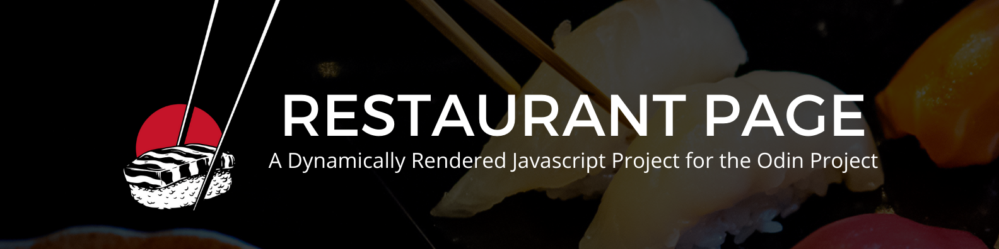

# Restaurant Page
A dynamically generated restaurant page created for [the Odin Project Ruby on Rails Course](https://www.theodinproject.com/courses/javascript/lessons/restaurant-page) to implement module import and export methods. This project uses Webpack for module bundling. 

## Features 
There are three main tabs, About, Contact, and Menu. By clicking a tab, the existing content is erased and filled with the appropriate content. All elements inside the content box are dynamically generated with Javascript. 

## Demo 
Check out the live version [here](https://zxum.github.io/restaurant-page/)

## Reflections
I am a huge fan of how organized the code can be with the usage of modules. This was my first time using Webpack and at first I didn't understand how it worked, but then I realized its similar to the way Ruby imports gems. Once I understood the connection, Webpack felt seamless to me. I also thought the way modules can be wrapped up and exported is very nice to work with! 